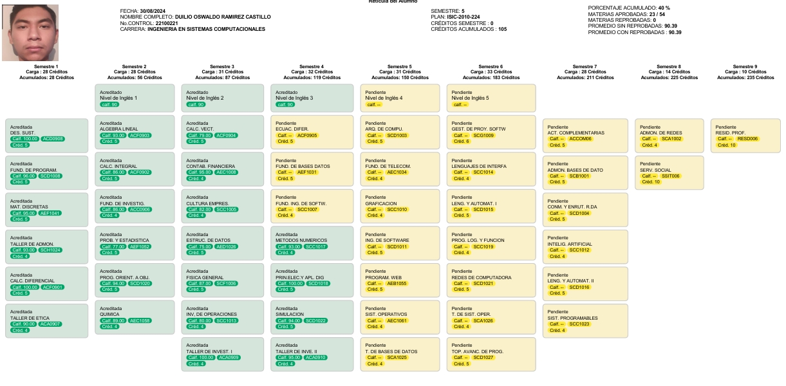

# **Duilio Oswaldo Ramirez Castillo**  
*Estudiante de ingenieria en sistemas computacionales en el tecnologico de nuevo laredo.*

## Pasatiempos/Hobbies
He dejado de lado muchos de mis pasatiempos por razones personales pero dentro de ellos estan:

1. Tocar la guitarra 🎸
2. Leer 📖
3. Escribir (pensamientos, poemas)
4. Hacer ejercicio en casa 🦾
5. Jugar videojuegos 🎮

## Musica y peliculas  
### Mis bandas y artistas favoritos 

1. PXNDX
2. Artic Monkeys
3. Muse
4. The beatles
5. Johnny Cash
6. José Madero

[Mi cancion favorita del momento](https://youtu.be/0fAQhSRLQnM?si=zoebiSWaYU5DhBue)

  
> "Hola, soy Johnny Cash"  -Johnny Cash

## Mis peliculas y series favoritas

| Nombre   | Calificacion 
|----------|----------|
| Malcolm in the middle   | ⭐⭐⭐⭐⭐|
| Shameless               | ⭐⭐⭐⭐  |
| Hajime No ipoo          | ⭐⭐⭐    |
| Golpe bajo              | ⭐⭐       |
| Creed (saga)            | ⭐⭐⭐    |
| Star wars (saga)        | ⭐⭐⭐⭐  |

## Historial Academico  
Mi Reticula

## Lenguajes de programacion que ya domino
Considero que no domino ninguno en su totalidad, sin embargo, uso C# desde que inicie la carrera y a comparacion de ese entonces ahora se mucho mas espero algun dia dominarlo y seguir aprendiendo sus aplicaciones en la vida laboral.

No he podido aprender ningun otro pero me gustaria aprender Phyton ya que hoy en dia es uno de los lenguajes mas usados y que se considera que todos deberiamos de aprender para expandir nuestras oportunidades laborales

## Trabajo
Actualmente no trabajo. Anteriormente trabajaba junto a mi familia en un deposito, donde trabajaba despues de clases y los fines de semana, trabajé ahi casi 6 años y fue una experiencia muy bonita, claro con buenos y malos momentos, sin embargo creo que fue algo que me ayudo a crecer como persona.
